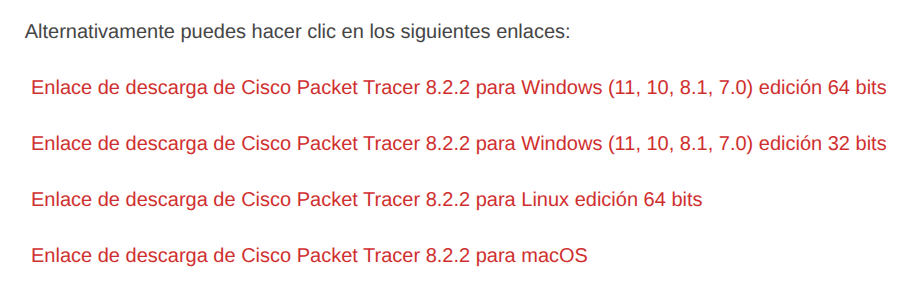
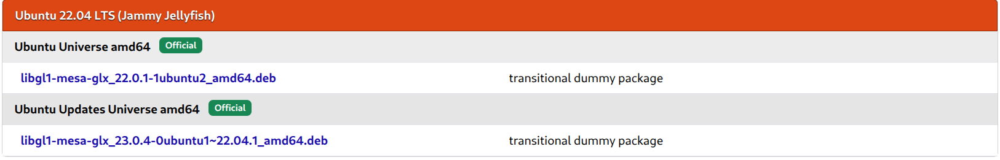

# Cisco Packet Tracer 8.2.2 Ubuntu 24.04

## Descarga

1. Abrir el enlace de [CCNA desde Cero](https://ccnadesdecero.es/descargar-packet-tracer/).



2. Seleccionar `Enlace de descarga de Cisco Packet Tracer 8.2.2 para Linux edición 64 bits` y descargar el archivo `.deb` desde Google Drive.

3. Verificar la descarga con:

```bash
sha1sum CiscoPacketTracer822_amd64_signed.deb 
35bd819fcb0e2ed1df3582387d599e4a9c6bf2c9  CiscoPacketTracer822_amd64_signed.deb
```

## Instalación

> [!important]
> Es necesario `libgl1-mesa-glx`. Para descargar el `.deb`, ir a [pkgs.org](https://pkgs.org/download/libgl1-mesa-glx)



4. Bajar el archivo `.deb` según la arquitectura.

5. Abrir una terminal en el directorio `Descargas` y ejecutar:

```bash
sudo dpkg -i libgl1-mesa-glx_22.0.1-1ubuntu2_amd64.deb
```

6. Instalar Cisco Packet Tracer:

```bash
sudo dpkg -i CiscoPacketTracer822_amd64_signed.deb
```

## Desinstalar

1. Desinstalar Packet Tracer 8.2.2:

```bash
sudo apt -y purge packettracer && sudo apt -y autopurge
rm -rf ~/.packettracer
rm -rf ~/pt
``` 

2. Verificar que se eliminó completamente:

```bash
dpkg -l | grep packet
which packettracer
```