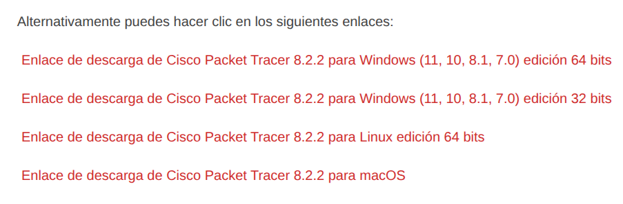
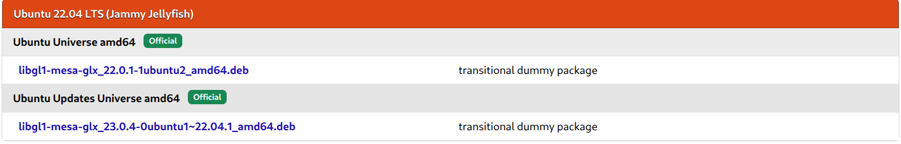

# Cisco Packet Tracer 8.2.2 Ubuntu 24.04

## Descarga

Descargar la v 8.2.2 seguir el enlace a [CCNA desde Cero](https://ccnadesdecero.es/descargar-packet-tracer/)



Seleccionar **Enlace de descarga de Cisco Packet Tracer 8.2.2 para Linux edición 64 bits** y bajar el archivo **.deb** de la carpeta de Google Drive.

Verificar descarga con 

```bash
sha1sum CiscoPacketTracer822_amd64_signed.deb 
35bd819fcb0e2ed1df3582387d599e4a9c6bf2c9  CiscoPacketTracer822_amd64_signed.deb
```

## Instalación

> [!important]
>  Es necesario libgl1-mesa-glx; para instalarla ir a [pkgs.org](https://pkgs.org/download/libgl1-mesa-glx)



Bajar el archivo **.deb** según la arquitectura.

Abrir una terminal en el directorio Descargas y ejecutar

```bash
sudo apt dpkg -i libgl1-mesa-glx_22.0.1-1ubuntu2_amd64.deb
```

Instalar Cisco PT

```bash
sudo apt dpkg -i CiscoPacketTracer822_amd64_signed.deb
```


